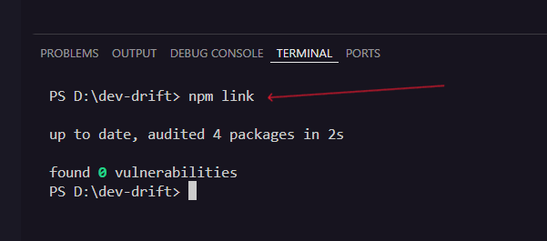

# dev-drift

A developer CLI tool that detects project drift — silent changes in Node version, environment variables, scripts, and folder structure that slowly break projects over time.

## Table of Contents

- [The Problem: Project Drift](#the-problem-project-drift)
- [How dev-drift Solves This](#how-dev-drift-solves-this)
- [Key Features](#key-features)
- [How dev-drift Works](#how-dev-drift-works)
- [Installation](#installation)
- [Usage](#usage)
- [Screenshots](#screenshots) 📸
- [Design Decisions](#design-decisions)
- [Project Structure](#project-structure)
- [Sample Output](#sample-output)
- [Detailed Documentation](#detailed-documentation)
- [Future Enhancements](#future-enhancements)
- [License](#license)

## The Problem: Project Drift

Have you ever returned to a project after weeks or months, only to find it no longer works? The build fails, tests break, or the app won't start. Nothing obvious changed, but something is different.

This is **project drift** — the silent accumulation of environmental changes that break projects over time:

- Your Node.js version updated automatically
- Environment variables were added, removed, or renamed
- Package.json scripts were modified
- Project folders were reorganized
- Dependencies shifted between production and development

Project drift is particularly frustrating because:
- Changes happen gradually and invisibly
- Multiple changes compound the debugging difficulty
- The root cause is often environmental, not code-related
- Symptoms appear long after the actual change occurred

## How dev-drift Solves This

dev-drift captures a snapshot of your project's "known good" state and later compares the current state against this baseline. When drift is detected, it tells you exactly what changed and when.

Instead of spending hours debugging mysterious failures, you get a clear report: "Node version changed from v18.0.0 to v20.0.0" or "Environment variable API_KEY was removed."

## Key Features

- **Snapshot-based detection**: Captures project state at a known good moment
- **Comprehensive monitoring**: Tracks Node version, environment variables, scripts, dependencies, and folder structure
- **Privacy-focused**: Stores only environment variable names, never values
- **Zero configuration**: Works out of the box with any Node.js project
- **Read-only operation**: Detects issues without making changes
- **Clear reporting**: Shows exactly what changed between snapshots

## How dev-drift Works

### The Snapshot Approach

1. **Initialize**: Run `dev-drift init` when your project is working correctly
2. **Capture**: Creates a baseline snapshot of your project's environmental state
3. **Monitor**: Run `dev-drift check` anytime to compare current state vs baseline
4. **Report**: Get a clear summary of any detected drift

### What Gets Tracked

- **Node.js version**: Detects version changes that might break compatibility
- **Environment variables**: Monitors .env file keys (values never stored)
- **Package.json scripts**: Tracks build, test, and custom script changes
- **Dependencies**: Monitors production and development dependency changes
- **Project structure**: Watches top-level folder additions and removals

### Why This Approach Works

Unlike live monitoring or complex configuration systems, snapshots provide:
- **Simplicity**: One baseline, clear comparisons
- **Reliability**: No background processes or system dependencies
- **Portability**: Works across different environments and CI systems
- **Clarity**: Shows exactly what changed since the last known good state

## Installation

### Prerequisites

- Node.js (any recent version)
- npm (comes with Node.js)

### Local Development Setup

```bash
# Clone or download the project
cd dev-drift

# Install as a global command (for development)
npm link

# Verify installation
dev-drift --help
```

## Usage

### Initialize Baseline

Create a snapshot when your project is working correctly:

```bash
dev-drift init
```

**Output:**
```
✓ dev-drift initialized.
```

This creates a `.dev-drift/baseline.json` file containing your project's current state.

### Check for Drift

Compare current state against the baseline:

```bash
dev-drift check
```

**No drift detected:**
```
✓ No drift detected.
```

**Drift detected:**
```
Drift detected:

Node version changed: v18.0.0 → v20.1.0
Env variable added: NEW_API_KEY
Folders were removed: old-components
Scripts is changed: build, test
```

### Reset Baseline

Remove the current baseline (requires re-initialization):

```bash
dev-drift reset
```

**Output:**
```
✓ Baseline reset.
✓ Run `dev-drift init` to create a new baseline.
```

## Screenshots

### Step 1: Setup and Installation

After cloning the repository, use `npm link` to install dev-drift as a global command for local development:



This screenshot shows:
- Cloning the dev-drift repository
- Running `npm link` to make the command globally available
- Verifying the installation works with `dev-drift --help`

### Step 2: Reset and Initialize Baseline

Clean slate setup by resetting any previous baseline and creating a fresh snapshot:


This screenshot demonstrates:
- `dev-drift reset` - Removes any existing baseline to start fresh
- `dev-drift init` - Creates a new baseline snapshot when the project is in a known good state
- The `.dev-drift/baseline.json` file is created with the current project state

### Step 3: Drift Detection in Action

After making changes to the project environment manually (can be anything, try changing the node version or adding something new env variable or creating new directory), dev-drift detects and reports the drift:


This screenshot shows:
- `dev-drift check` command detecting multiple types of drift
- Clear reporting of what changed:
  - Node version changes
  - Environment variable additions/removals
  - Folder structure modifications
  - Package.json script changes
- Detailed output that helps developers understand exactly what environmental changes occurred

These screenshots demonstrate the complete workflow from installation to drift detection, showing how dev-drift provides immediate visibility into project environmental changes that could cause mysterious failures.

## Design Decisions

### Why Only Environment Variable Keys?

Environment variables often contain sensitive data like API keys, database URLs, and passwords. dev-drift stores only the variable names, never their values, ensuring:
- **Security**: No sensitive data in snapshots
- **Privacy**: Safe to commit baseline files to version control
- **Functionality**: Still detects when variables are added, removed, or renamed

### Why Baselines Aren't Auto-Overwritten?

Automatic baseline updates would defeat the purpose of drift detection:
- **Intentionality**: Changes should be deliberate, not automatic
- **Debugging**:  need to see what changed, not just accept it
- **Control**: Developers decide when the project state is "good"

### Why Snapshot Comparison?

Alternative approaches like live monitoring or configuration files have drawbacks:
- **Live monitoring**: Complex, resource-intensive, requires background processes
- **Configuration files**: Require manual maintenance, easy to forget updating
- **Snapshots**: Simple, reliable, capture actual state rather than intended state

### Why Read-Only Operation?

dev-drift intentionally does not fix detected issues because:
- **Safety**: Automatic fixes could break working configurations
- **Understanding**: Developers need to understand what changed and why
- **Flexibility**: Different projects need different solutions to the same drift

## Project Structure

```
dev-drift/
├── bin/
│   └── dev-drift.js          # CLI entry point and command handling
├── src/
│   ├── snapshot.js           # Captures project state snapshots
│   ├── compare.js            # Compares baseline vs current snapshots
│   └── reporter.js           # Formats and displays drift reports
├── .dev-drift/
│   └── baseline.json         # Stored project baseline (created by init)
├── package.json              # Project configuration and dependencies
└── README.md                 # This documentation
```

## Sample Output

### No Drift Scenario

When your project state matches the baseline:

```bash
$ dev-drift check
✓ No drift detected.
```

### Drift Detected Scenario

When changes are found:

```bash
$ dev-drift check
Drift detected:

Node version changed: v18.15.0 → v20.1.0
Env variable added: REDIS_URL, CACHE_TTL
Env variable removed: OLD_API_ENDPOINT
Folders were added: migrations, scripts
Scripts is changed: build, deploy
```

This output immediately tells you:
- Node.js was upgraded (might affect compatibility)
- New environment variables were added (might need configuration)
- An old environment variable was removed (might break functionality)
- New folders appeared (project structure changed)
- Build and deploy scripts were modified (might affect deployment)

## Detailed Documentation

For comprehensive information about dev-drift, see the `/docs` folder:

- **[Overview](docs/overview.md)**: Deep dive into project drift and real-world examples
- **[Commands](docs/commands.md)**: Detailed command reference with examples and troubleshooting
- **[Architecture](docs/architecture.md)**: Internal structure and data flow explanation
- **[Design Decisions](docs/design-decisions.md)**: Rationale behind key architectural choices
- **[Troubleshooting](docs/troubleshooting.md)**: Common issues and solutions

## Future Enhancements

The following features are intentionally not implemented to maintain simplicity:

- **Snapshot history**: Multiple baselines and rollback capability
- **Force reset**: Overwrite baseline without manual reset
- **CI integration**: Automated drift detection in build pipelines
- **Custom ignore rules**: Exclude specific files or folders from monitoring
- **Drift fixing**: Automatic resolution of detected issues
- **Configuration files**: Custom monitoring rules and thresholds

These omissions are deliberate design choices prioritizing simplicity and reliability over feature completeness.

## License

ISC
